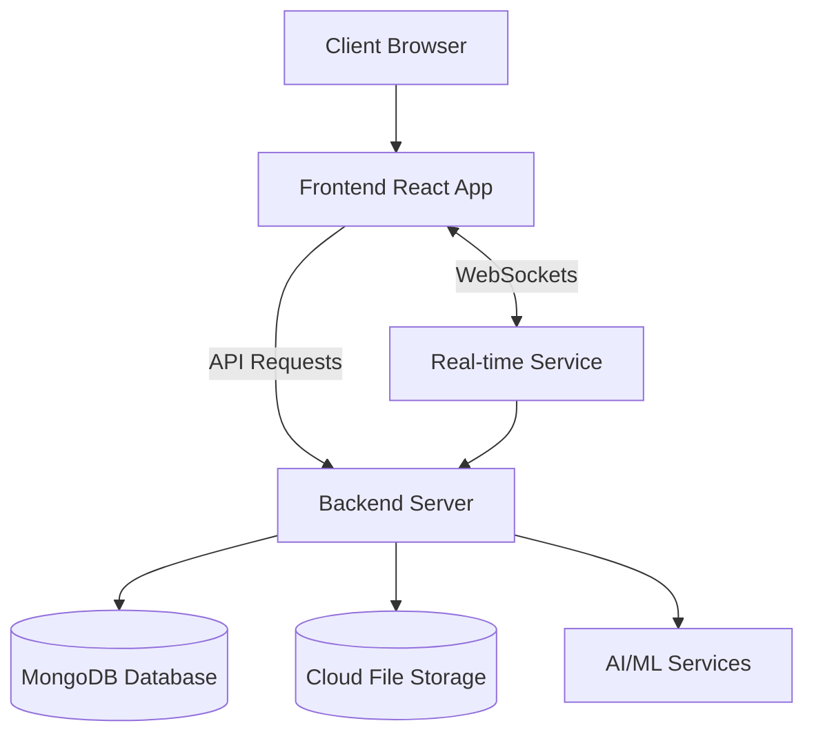
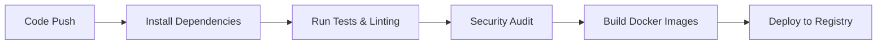

<a id="readme-top"></a>

<!-- PROJECT SHIELDS -->
[![Contributors][contributors-shield]][contributors-url]
[![Forks][forks-shield]][forks-url]
[![Stargazers][stars-shield]][stars-url]
[![Issues][issues-shield]][issues-url]
[![MIT License][license-shield]][license-url]
[![LinkedIn][linkedin-shield]][linkedin-url]

<!-- PROJECT LOGO -->
<br />
<div align="center">
  <a href="https://github.com/hsinemt/Integrated-project-management-application">
    
  </a>

<h3 align="center">Projexus Platform</h3>

  <p align="center">
    Integrated Project Management Solution for Modern Teams
    <br />
    <a href="https://github.com/hsinemt/Integrated-project-management-application"><strong>Explore the docs »</strong></a>
    <br />
    <br />
    <a href="https://projexus.live/">View Live Site</a>
    ·
    <a href="https://github.com/hsinemt/Integrated-project-management-application/issues/new?labels=bug">Report Bug</a>
    ·
    <a href="https://github.com/hsinemt/Integrated-project-management-application/issues/new?labels=enhancement">Request Feature</a>
  </p>
</div>

<!-- TABLE OF CONTENTS -->
<details>
  <summary>Table of Contents</summary>

- [Overview](#overview)
- [Key Features](#key-features)
- [Screenshots](#screenshots)
- [Quick Start](#quick-start)
- [Technology Stack](#technology-stack)
- [Architecture](#architecture)
- [Detailed Features](#detailed-features)
- [Project Structure](#project-structure)
- [Installation Guide](#installation-guide)
    - [Prerequisites](#prerequisites)
    - [Local Development](#local-development)
    - [Docker Deployment](#docker-deployment)
- [API Documentation](#api-documentation)
- [CI/CD Pipeline](#cicd-pipeline)
- [Contributing](#contributing)
- [Troubleshooting & FAQs](#troubleshooting--faqs)
- [Roadmap](#roadmap)
- [Team & Contributors](#team--contributors)
- [License](#license)
- [Contact & Support](#contact--support)

## 🚀 Overview

Projexus Platform is a comprehensive project management application designed to streamline team collaboration, task management, and project tracking. The platform integrates various features including task boards, chat functionality, file management, calendars, and AI-powered tools to enhance productivity and project coordination.


## ✨ Key Features

* **Unified Project Dashboard** - Get a bird's eye view of all your projects in one place
* **Smart Task Management** - AI-powered task organization and priority suggestions
* **Real-time Collaboration** - Chat and collaborative document editing
* **Advanced Analytics** - Customizable reports and performance metrics
* **Seamless Integration** - Connect with tools you already use
* **Enterprise-grade Security** - Role-based access control and data protection

<p align="right">(<a href="#readme-top">back to top</a>)</p>


<!-- SCREENSHOTS -->
## Screenshots

[![Dashboard View][screenshot-dashboard]](https://example.com)
[![Task Details][screenshot-taskboard]](https://example.com)
[![Calendar View][screenshot-calendar]](https://example.com)
[![Team Chat][screenshot-chat]](https://example.com)

<p align="right">(<a href="#readme-top">back to top</a>)</p>


<!-- QUICK START -->
## Quick Start

Get Projexus up and running in minutes:

```bash
# Clone the repository
git clone https://github.com/hsinemt/Integrated-project-management-application
cd Integrated-project-management-application

# Start with Docker Compose
docker-compose up -d

# Access the application
# Frontend: http://localhost
# Backend API: http://localhost:9777
```

<p align="right">(<a href="#readme-top">back to top</a>)</p>


<!-- TECHNOLOGY STACK -->
## Technology Stack

### Frontend

* [![React][React.js]][React-url]
* [![TypeScript][TypeScript.js]][TypeScript-url]
* [![Redux][Redux.js]][Redux-url]
* [![Bootstrap][Bootstrap.com]][Bootstrap-url]
* [![Material UI][Material-UI.js]][Material-UI-url]
* [![Ant Design][Ant-Design.js]][Ant-Design-url]
* [![Socket.io][Socket.io]][Socket-io-url]

### Backend

* [![Node.js][Node.js]][Node-url]
* [![Express][Express.js]][Express-url]
* [![MongoDB][MongoDB]][MongoDB-url]
* [![JWT][JWT]][JWT-url]
* [![Socket.io][Socket.io]][Socket-io-url]
* [![OpenAI][OpenAI]][OpenAI-url]

<p align="right">(<a href="#readme-top">back to top</a>)</p>

<!-- ARCHITECTURE -->
## Architecture

The Projexus Platform follows a microservices architecture with separate frontend and backend services communicating via RESTful APIs and WebSockets for real-time updates.



<p align="right">(<a href="#readme-top">back to top</a>)</p>


<!-- DETAILED FEATURES -->
## Detailed Features

<details>
  <summary><b>Project Management</b></summary>
  <ul>
    <li>Project creation, tracking, and detailed views</li>
    <li>Task boards with drag-and-drop functionality</li>
    <li>Task assignment and progress tracking</li>
    <li>Project timelines and milestones</li>
    <li>Resource allocation and capacity planning</li>
    <li>Multiple project view options (Kanban, list, calendar)</li>
  </ul>
</details>

<details>
  <summary><b>Team Collaboration</b></summary>
  <ul>
    <li>Real-time chat and messaging</li>
    <li>File sharing and document management</li>
    <li>Collaborative document editing</li>
  </ul>
</details>

<details>
  <summary><b>Task Management</b></summary>
  <ul>
    <li>Kanban boards for visual task management</li>
    <li>Todo lists and task prioritization</li>
    <li>Task dependencies and relationships</li>
    <li>Deadline tracking and notifications</li>
    <li>Recurring tasks automation</li>
    <li>Subtasks and checklists</li>
  </ul>
</details>

<details>
  <summary><b>User Management</b></summary>
  <ul>
    <li>Role-based access control</li>
    <li>User profiles and authentication</li>
    <li>Multi-factor authentication</li>
    <li>OAuth integration (Google, GitHub)</li>
    <li>Team organization and department structures</li>
    <li>User activity tracking</li>
  </ul>
</details>

<details>
  <summary><b>Calendar & Scheduling</b></summary>
  <ul>
    <li>Interactive calendar views</li>
    <li>Event scheduling and management</li>
    <li>Deadline visualization</li>
    <li>Time tracking</li>
    <li>Resource scheduling</li>
    <li>Integration with external calendars</li>
  </ul>
</details>

<details>
  <summary><b>AI-Powered Features</b></summary>
  <ul>
    <li>Natural language processing for task analysis</li>
    <li>AI-assisted project planning</li>
    <li>Generative AI tools for content creation</li>
    <li>Face recognition for authentication</li>
    <li>Smart resource allocation suggestions</li>
    <li>Predictive analytics for project timelines</li>
  </ul>
</details>

<details>
  <summary><b>Reporting & Analytics</b></summary>
  <ul>
    <li>Project progress dashboards</li>
    <li>Performance metrics and charts</li>
    <li>Custom reports generation</li>
    <li>Data visualization tools</li>
    <li>Export options (PDF, Excel, CSV)</li>
    <li>Automated reporting schedules</li>
  </ul>
</details>

<p align="right">(<a href="#readme-top">back to top</a>)</p>

<!-- PROJECT STRUCTURE -->
## Project Structure

```
/
├── Front-End/           # React frontend application
│   ├── src/             # Source code
│   │   ├── api/         # API integration
│   │   ├── core/        # Core components
│   │   ├── feature-module/ # Feature-specific modules
│   ├── public/          # Static assets
│   └── build/           # Production build
│
├── Back-End/            # Node.js backend application
│   ├── Config/          # Configuration files
│   ├── Controllers/     # Business logic handlers
│   ├── Middlewares/     # Custom middleware functions
│   ├── Models/          # Database schemas and models
│   ├── Routes/          # API route definitions
│   ├── services/        # Service layer
│   ├── uploads/         # File upload storage
│   └── server.js        # Main server entry point
│
├── docker-compose.yml   # Docker compose configuration
├── .github/workflows/   # CI/CD pipeline configurations
└── README.md            # This documentation file
```

<p align="right">(<a href="#readme-top">back to top</a>)</p>


<!-- INSTALLATION GUIDE -->
## Installation Guide

### Prerequisites

* Node.js 18.x or higher
* MongoDB 6.x or higher
* Docker and Docker Compose (for containerized deployment)
* Git

### Local Development

#### Backend Setup

```bash
# Navigate to backend directory
cd Back-End

# Install dependencies
npm install

# Create environment configuration
cp .env.example .env
# Edit .env with your configuration

# Start backend server
npm start
# Server available at http://localhost:9777
```

#### Frontend Setup

```bash
# Navigate to frontend directory
cd Front-End

# Install dependencies
npm install

# Start development server
npm start
# Frontend available at http://localhost:3000
```

### Docker Deployment

```bash
# Clone the repository
git clone https://github.com/hsinemt/Integrated-project-management-application
cd Integrated-project-management-application

# Create environment configuration
cp .env.example .env
# Edit .env with your configuration

# Start with Docker Compose
docker-compose up -d

# Access the application
# Frontend: http://localhost
# Backend API: http://localhost:9777
```

#### Using Pre-built Docker Images

```bash
docker pull ghcr.io/[repository-owner]/projexus-frontend:latest
docker pull ghcr.io/[repository-owner]/projexus-backend:latest
```

<p align="right">(<a href="#readme-top">back to top</a>)</p>

## 📚 API Documentation

The Projexus Platform provides a comprehensive RESTful API. Detailed documentation is available at:

- **Development Environment**: http://localhost:9777/api-docs
- **Production Environment**: https://api.projexusplatform.com/api-docs

Key API endpoints include:

- `/api/auth` - Authentication and user management
- `/api/projects` - Project CRUD operations
- `/api/tasks` - Task management
- `/api/teams` - Team organization
- `/api/files` - File storage and retrieval

## 🔄 CI/CD Pipeline

Projexus uses GitHub Actions for continuous integration and deployment. The pipeline runs tests, linting, security checks, and deploys Docker containers automatically.

### Main Pipeline Workflow



The CI pipeline runs on pushes and pull requests to the main, development, and Code-Overview branches, while the CD part (deployment) only runs on pushes to the main branch.

## 🤝 Contributing

We welcome contributions to Projexus! Please follow these steps to contribute:

1. **Fork the Repository**
2. **Create a Branch**
   ```bash
   git checkout -b feature/your-feature-name
   ```
3. **Make Changes and Commit**
   ```bash
   git add .
   git commit -m "Add feature: your feature description"
   ```
4. **Push to Your Fork**
   ```bash
   git push origin feature/your-feature-name
   ```
5. **Create a Pull Request**
    - Ensure your code follows the project's coding standards
    - Include tests for new features
    - Update documentation as needed

Please review our [Contributing Guidelines](CONTRIBUTING.md) for more details.

<!-- TROUBLESHOOTING & FAQS -->
## Troubleshooting & FAQs

<details>
  <summary><b>Common Issues</b></summary>

### I'm getting a connection error with MongoDB
Ensure MongoDB is running and check your connection string in the `.env` file.

### The Docker containers won't start
Check if ports 80 and 9777 are already in use on your system.

### I can't log in with OAuth
Verify your OAuth credentials in the environment configuration.

### File uploads are failing
Check your Cloudinary configuration and ensure the uploads directory is writable.
</details>

<p align="right">(<a href="#readme-top">back to top</a>)</p>


<!-- ROADMAP -->
## Roadmap

- [x] Base project setup and infrastructure
- [x] User authentication and authorization
- [x] Project management core features
- [ ] Mobile application release
- [ ] Enhanced AI project assistant
- [ ] Advanced resource management
- [ ] Enterprise SSO integration
- [ ] Automated workflow builder
- [ ] Advanced reporting features

See the [open issues](https://github.com/hsinemt/Integrated-project-management-application/issues) for a full list of proposed features (and known issues).

<p align="right">(<a href="#readme-top">back to top</a>)</p>


<!-- TEAM & CONTRIBUTORS -->
## Team & Contributors

<a href="https://github.com/hsinemt/Integrated-project-management-application/graphs/contributors">
  
</a>

Special thanks to all our contributors and team members who have helped make Projexus possible!

<p align="right">(<a href="#readme-top">back to top</a>)</p>


<!-- LICENSE -->
## License

Distributed under the MIT License. See `LICENSE.txt` for more information.

<p align="right">(<a href="#readme-top">back to top</a>)</p>


<!-- CONTACT & SUPPORT -->
## Contact & Support

Project Link: [https://github.com/hsinemt/Integrated-project-management-application](https://github.com/hsinemt/Integrated-project-management-application)
Official Website: [https://projexus.live/](https://projexus.live/)

* **Issues & Bug Reports**: [GitHub Issues](https://github.com/hsinemt/Integrated-project-management-application/issues)
* **Feature Requests**: [GitHub Discussions](https://github.com/hsinemt/Integrated-project-management-application/discussions)
* **Email Support**: support@projexusplatform.com

<p align="right">(<a href="#readme-top">back to top</a>)</p>


<!-- MARKDOWN LINKS & IMAGES -->
<!-- https://www.markdownguide.org/basic-syntax/#reference-style-links -->
[contributors-shield]: https://img.shields.io/github/contributors/hsinemt/Integrated-project-management-application.svg?style=for-the-badge
[contributors-url]: https://github.com/hsinemt/Integrated-project-management-application/graphs/contributors
[forks-shield]: https://img.shields.io/github/forks/hsinemt/Integrated-project-management-application.svg?style=for-the-badge
[forks-url]: https://github.com/hsinemt/Integrated-project-management-application/network/members
[stars-shield]: https://img.shields.io/github/stars/hsinemt/Integrated-project-management-application.svg?style=for-the-badge
[stars-url]: https://github.com/hsinemt/Integrated-project-management-application/stargazers
[issues-shield]: https://img.shields.io/github/issues/hsinemt/Integrated-project-management-application.svg?style=for-the-badge
[issues-url]: https://github.com/hsinemt/Integrated-project-management-application/issues
[license-shield]: https://img.shields.io/github/license/hsinemt/Integrated-project-management-application.svg?style=for-the-badge
[license-url]: https://github.com/hsinemt/Integrated-project-management-application/blob/master/LICENSE.txt
[linkedin-shield]: https://img.shields.io/badge/-LinkedIn-black.svg?style=for-the-badge&logo=linkedin&colorB=555
[linkedin-url]: https://linkedin.com/in/yourprofile
[screenshot-dashboard]: images/screenshot-dashboard.png
[screenshot-taskboard]: images/screenshot-taskboard.png
[screenshot-calendar]: images/screenshot-calendar.png
[screenshot-chat]: images/screenshot-chat.png
[React.js]: https://img.shields.io/badge/React-20232A?style=for-the-badge&logo=react&logoColor=61DAFB
[React-url]: https://reactjs.org/
[TypeScript.js]: https://img.shields.io/badge/TypeScript-007ACC?style=for-the-badge&logo=typescript&logoColor=white
[TypeScript-url]: https://www.typescriptlang.org/
[Redux.js]: https://img.shields.io/badge/Redux-593D88?style=for-the-badge&logo=redux&logoColor=white
[Redux-url]: https://redux.js.org/
[Bootstrap.com]: https://img.shields.io/badge/Bootstrap-563D7C?style=for-the-badge&logo=bootstrap&logoColor=white
[Bootstrap-url]: https://getbootstrap.com
[Material-UI.js]: https://img.shields.io/badge/Material--UI-0081CB?style=for-the-badge&logo=material-ui&logoColor=white
[Material-UI-url]: https://mui.com/
[Ant-Design.js]: https://img.shields.io/badge/Ant%20Design-0170FE?style=for-the-badge&logo=ant-design&logoColor=white
[Ant-Design-url]: https://ant.design/
[Node.js]: https://img.shields.io/badge/Node.js-43853D?style=for-the-badge&logo=node.js&logoColor=white
[Node-url]: https://nodejs.org/
[Express.js]: https://img.shields.io/badge/Express.js-404D59?style=for-the-badge
[Express-url]: https://expressjs.com/
[MongoDB]: https://img.shields.io/badge/MongoDB-4EA94B?style=for-the-badge&logo=mongodb&logoColor=white
[MongoDB-url]: https://www.mongodb.com/
[JWT]: https://img.shields.io/badge/JWT-000000?style=for-the-badge&logo=JSON%20web%20tokens&logoColor=white
[JWT-url]: https://jwt.io/
[Socket.io]: https://img.shields.io/badge/Socket.io-010101?style=for-the-badge&logo=socket.io&logoColor=white
[Socket-io-url]: https://socket.io/
[OpenAI]: https://img.shields.io/badge/OpenAI-412991?style=for-the-badge&logo=openai&logoColor=white
[OpenAI-url]: https://openai.com/
